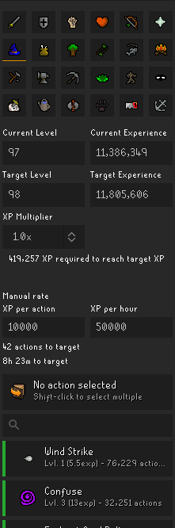

# Better Skill Calculator

A RuneLite sidebar plugin — an extended fork of the built-in Skill Calculator.

## Features

- Every trainable skill in the selector (not only skills with bundled action data).
- Set **From** and **To** by either level or XP; the panel shows total XP required.
- Auto-loads your current level and XP for a skill when you open it.
- **Manual rate** section: enter XP/action and/or XP/hour to get actions-to-target
  and time-to-target.

## Attribution

Forked from the RuneLite client's Skill Calculator plugin, licensed under the
BSD-2-Clause license. The original copyright headers are retained in the copied
source files. RuneLite is © the RuneLite developers.

## Development

Developed on NixOS using Bolt Launcher. 
Requires JDK 11 and a local RuneLite dev build published to mavenLocal.

    nix-shell --run "./gradlew run"     # launch RuneLite with this plugin
    ./gradlew test                      # run unit tests